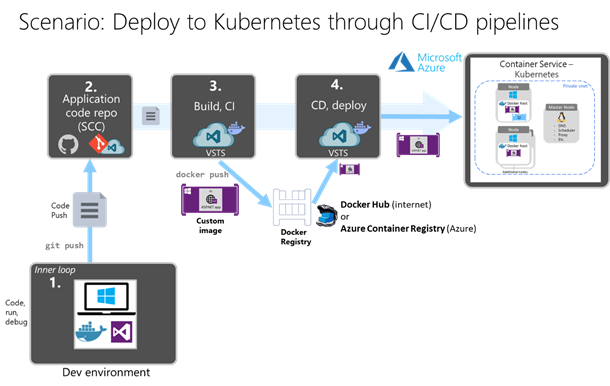
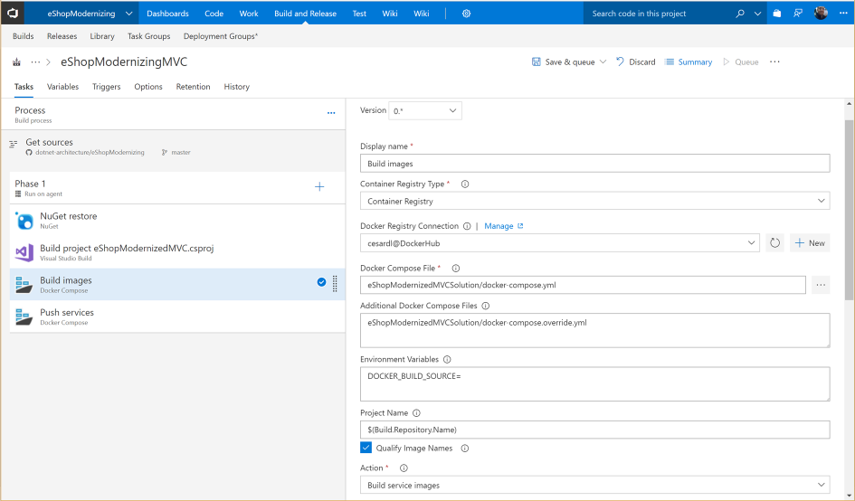
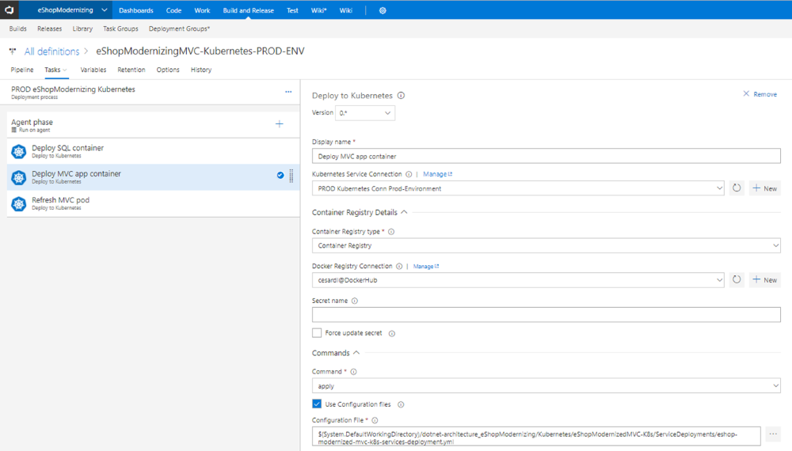

# Creating CI/CD pipelines in Azure DevOps Services for a .NET Core 2.0 application on Containers and deploying to a Kubernetes cluster

In Figure 5-12 you can see the end-to-end DevOps scenario covering the code management, code compilation, Docker images build, Docker images push to a Docker registry and finally the deployment to a Kubernetes cluster in Azure.

**Figure 5-12**. CI/CD scenario creating Docker images and deploying to a Kubernetes cluster in Azure

It is important to highlight that the two pipelines, build/CI, and release/CD, are connected through the Docker Registry (such as Docker Hub or Azure Container Registry). The Docker registry is one of the main differences compared to a traditional CI/CD process without Docker.

As shown in Figure 5-13, the first phase is the build/CI pipeline. In Azure DevOps Services you can create build/CD pipelines that will compile the code, create the Docker images, and push them to a Docker Registry like Docker Hub or Azure Container Registry.

**Figure 5-13**. Build/CI pipeline in Azure DevOps building Docker images and pushing images to a Docker registry

The second phase is to create a deployment/release pipeline. In Azure DevOps Services, you can easily create a deployment pipeline targeting a Kubernetes cluster by using the Kubernetes tasks for Azure DevOps Services, as shown in Figure 5-14.

**Figure 5-14**. Release/CD pipeline in Azure DevOps Services deploying to a Kubernetes cluster

> [!Walkthrough] Deploying eShopModernized to Kubernetes:
>
> For a detailed walkthrough of Azure DevOps CI/CD pipelines deploying to Kubernetes, see this post: \
><https://github.com/dotnet-architecture/eShopModernizing/wiki/04.-How-to-deploy-your-Windows-Containers-based-apps-into-Kubernetes-in-Azure-Container-Service-(Including-CI-CD)>

>[!div class="step-by-step"]
>[Previous](docker-application-outer-loop-devops-workflow.md)
>[Next](../run-manage-monitor-docker-environments/index.md)
